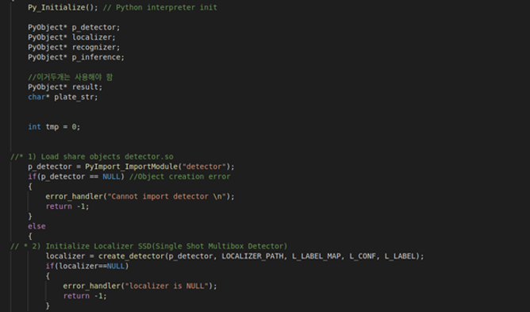
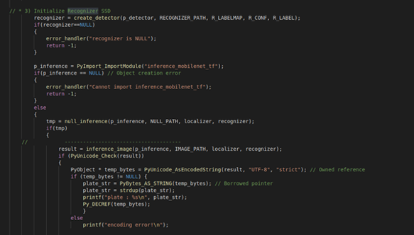
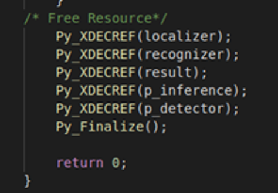
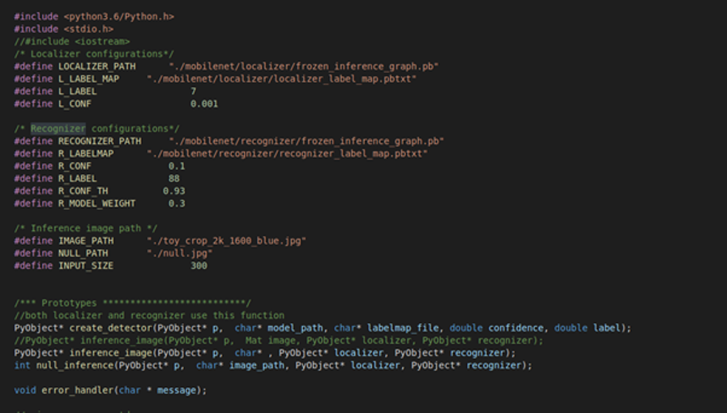
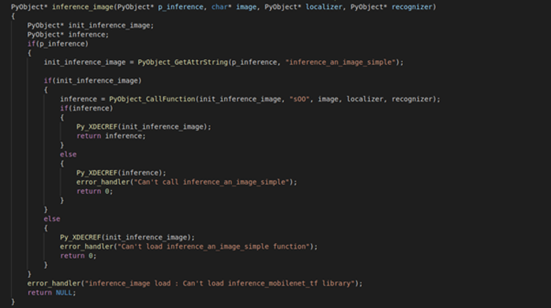

------------------
# c에서 python 사용하기
---------------------

###  파일 임포트하기

*이렇게 안해도 될수도 있음..*

1. python을 c파일로 변환한다.

   cython -a *파일이름*.py

2. c 파일을 so파일로 바꿔준다.

   gcc -o **-I/usr/include/python3.6 (*python라이브러리 경로*)**  *파일명*.so *파일명*.c

3. 링킹해서 실행파일 생성.

   gcc *파일명*.cpp -o test(*실행파일 명*) **-I/user/include/python3.6/ -lpython3.6m -lm -L/user/lib/python3.6/config**

### 코드상으로 사용하기

참고 :[https://docs.python.org/3/c-api/arg.html#c.Py_BuildValue](https://docs.python.org/3/c-api/arg.html)

`Py_Initialize();`  : 파이썬 모듈을 쓰기 위한 초기화

`PyObject* ▲;` : 파이썬 객체를 사용하기 위한 객체 포인터

`▲ = PyImport_ImportModule(“파일명.so(혹은 .py)”); ` : 모듈 임포트. 못찾으면 null 리턴.

` ★= PyObject_GetAttrString(▲, “python파일의 함수이름");` : 이름으로 so파일에서 함수를 찾음

`◆ = PyObject_CallFunction(★, "sOd", python파일의 함수의 매개변수);`

: 찾아온 값으로 함수를 호출.

: arg2 format : "s-str, O(영대문자) - pyobject, d-double" 등..

`Py_XDECREF(▲);`  : 리소스 할당 해제. 레퍼런스 카운트 줄이는 함수

`Py_Finalize(); ` : 파이썬 모듈 끝.

잭슨나노에서 사용할 때는

` PyRun_SimpleString("import os,sys");`

 ` PyRun_SimpleString("sys.path.append(os.getcwd())");`

두 줄을 통한 경로 추가가 필수적임 (왜인지는 모르겠음)

**python에서 return값을 여러 개 넘길 때(리턴형 default는 튜플)**

`int PyArg_ParseTuple(PyObject *args, const char *format, ...)` 을 사용.

: python에서 튜플로 넘어온 값들을 파싱해줌.

: c++형에 맞게 변환해줘서 변수에 있는 값들을 바로 가져다 쓸 수 있음.

: 성공시 1, 실패시 0 리턴.

ex)

`PyArg_ParseTuple(result, "sss(iiii)(iiii)", &ob1, &carbrand, &platetype, &carx1, &cary1, &carx2, &cary2, &platex1, &platey1, &platex2, &platey2)`

### 참고사진

--------------------------------------------------

